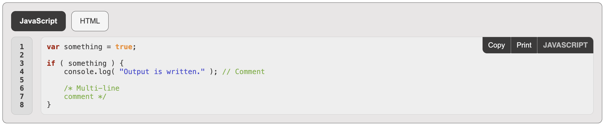
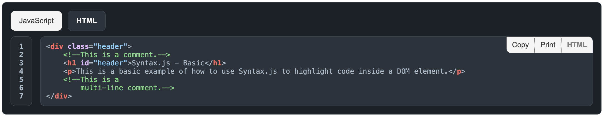

<h1 align="center">
Syntax.js

[](https://twitter.com/intent/tweet?text=Syntax.js%2C%20a%20free%20JavaScript%20syntax%20highlighter&url=https://github.com/williamtroup/Syntax.js&hashtags=javascript,syntax,highlighter)
[](https://www.npmjs.com/package/jsyntax.js)
[](https://www.nuget.org/packages/jSyntax.js/)
[](https://github.com/williamtroup/Syntax.js/blob/main/LICENSE.txt)
[](https://github.com/williamtroup/Syntax.js/discussions)
[](https://www.william-troup.com/)
</h1>

> <p align="center">A lightweight, and easy-to-use, JavaScript library for code syntax highlighting!</p>
> <p align="center">v3.0.0</p>
<br />




<br>
<br>

<h1>What features does Syntax.js have?</h1>

- Zero-dependencies and extremely lightweight!
- Highlights keywords, values, strings, and comments.
- 51 language translations available!
- Full API available via public functions.
- Fully styled in CSS/SASS (including the buttons) and compatible with the Bootstrap library.
- Full CSS theme support (using :root variables, with a default dark-mode theme).
- Coping and Printing support is available via action buttons.
- Custom triggers for actions (when elements are rendered, keywords are clicked, etc).
- 27 of the most popular languages built in by default (with public function support to add more).
- Language aliases.
- Custom action buttons (via a binding attribute), with opening/closing support.
- Unknown language support (renders the display, but does not highlight any syntax).
- Tabbing (allows multiple languages to be shown in one tabbed container, which is great for code examples).
<br />
<br />


<h1>Where can I find the documentation?</h1>

All the documentation can be found [here](https://www.william-troup.com/syntax-js/documentation/index.html):  
<br>
<br>


<h1>What browsers are supported?</h1>

All modern browsers (such as Google Chrome, FireFox, and Opera) are fully supported.
<br>
<br>


<h1>What languages are supported?</h1>

- `af` Afrikaans
- `ar` Arabic
- `hy` Armenian
- `be` Belarusian
- `bn` Bengali
- `bg` Bulgarian
- `ca` Catalan
- `zh` Chinese (simplified)
- `da` Danish
- `nl` Dutch
- `en` English (default)
- `eo` Esperanto
- `et` Estonian
- `fa` Farsi
- `fi` Finnish
- `fr` French
- `fy` Frisian
- `gl` Galician
- `ka` Georgian
- `de` German
- `el` Greek
- `he` Hebrew
- `hi` Hindi
- `hu` Hungarian
- `is` Icelandic
- `id` Indonesian
- `ga` Irish
- `it` Italian
- `ja` Japanese
- `ko` Korean
- `lv` Latvian
- `lt` Lithuanian
- `lb` Luxembourgish
- `ms` Malay
- `ne` Nepali
- `no` Norwegian
- `pl` Polish
- `pt` Portuguese
- `ro` Romanian
- `si` Sinhalese
- `sk` Slovak
- `sl` Slovenian
- `es` Spanish
- `sv` Swedish
- `tl` Tagalog
- `ta` Tamil
- `zh-tw` Taiwanese
- `te` Telugu
- `th` Thai
- `tr` Turkish
- `uk` Ukrainian
<br>
<br>


<h1>What are the most recent changes?</h1>

To see a list of all the most recent changes, click [here](https://www.william-troup.com/syntax-js/documentation/recent-changes.html).
<br>
<br>


<h1>What programming languages are supported by default?</h1>

- `bash` Bash
- `c-plus-plus` C++
- `c-sharp` C#
- `c` C
- `css` CSS
- `dart` Dart
- `delphi` Delphi
- `f-sharp` F#
- `go` GO
- `html` HTML
- `java` Java
- `javascript` JavaScript
- `kotlin` Kotlin
- `lua` Lua
- `matlab` Matlab
- `ms-sql` Microsoft SQL
- `perl` Perl
- `php` PHP
- `powershell` Powershell
- `python` Python
- `r` R
- `ruby` Ruby
- `rust` Rust
- `scala` Scala
- `swift` Swift
- `typescript` TypeScript
- `visual-basic` Visual Basic
<br>
<br>


<h1>How do I install Syntax.js?</h1>

You can install the library with npm into your local modules directory using the following command:

```markdown
npm install jsyntax.js
```

Or, you can download the latest zipped up version [here](https://www.william-troup.com/syntax-js/download.html).
<br>
<br>


<h1>How do I get started?</h1>

To get started using Syntax.js, do the following steps:
<br>
<br>

### 1. Prerequisites:

Make sure you include the "DOCTYPE html" tag at the top of your HTML, as follows:

```markdown
<!DOCTYPE html>
```
<br>

### 2. Include Files:

```markdown
<link rel="stylesheet" href="dist/syntax.js.css">
<script src="dist/syntax.js"></script>
<script src="dist/languages/syntax.javascript.js"></script>
<script src="dist/languages/syntax.html.js"></script>
```
<br>

### 3. DOM Element Binding:

```markdown
<div data-syntax-language="javascript">
    var something = true;

    if ( something ) {
        console.log( "Output is written." ); // Comment
        
        /* Multi-line
        comment */
    }
</div>

<code data-syntax-language="javascript" data-syntax-options="{ 'showCopyButton': false }" data-syntax-buttons="[ { 'text': 'Button 1', 'onClick': yourJsFunction } ]">
    <pre>
        var something = true;

        if ( something ) {
            console.log( "Output is written." ); // Comment
            
            /* Multi-line
            comment */
        }
    </pre>
</code>

<code data-syntax-language="tabbed">
    <div data-syntax-language="javascript" data-syntax-tab-contents="true">
        <pre>
            var something = true;

            if ( something ) {
                console.log( "Output is written." ); // Comment
                
                /* Multi-line
                comment */
            }
        </pre>
    </div>

    <div data-syntax-language="html" data-syntax-tab-contents="{ 'title': 'HTML Language' }">
        <pre>
            <div class="header">
                <!--This is a comment.-->
                <h1 id="header">Syntax.js - Basic</h1>
                <p>This is a basic example of how to use Syntax.js to highlight code inside a DOM element.</p>
                <!--This is a 
                    multi-line comment.-->
            </div>
        </pre>
    </div>
</code>
```

To see a list of all the available binding languages you can use for "data-syntax-language", click [here](docs/binding/language/LANGUAGE.md).

To see a list of all the available binding options you can use for "data-syntax-options", click [here](https://www.william-troup.com/syntax-js/documentation/binding-options.html).

To see a list of all the available custom triggers you can use for "data-syntax-options", click [here](https://www.william-troup.com/syntax-js/documentation/binding-options-custom-triggers.html).

To see a list of all the available binding options you can use for "data-syntax-buttons", click [here](https://www.william-troup.com/syntax-js/documentation/buttons.html).

To see a list of all the available binding options you can use for "data-syntax-tab-contents", click [here](https://www.william-troup.com/syntax-js/documentation/tabs.html).

<br>

### 4. Finishing Up:

That's it! Nice and simple. Please refer to the code if you need more help (fully documented).
<br>
<br>

<h1>How do I go about customizing Syntax.js?</h1>

To customize, and get more out of Syntax.js, please read through the following documentation.
<br>
<br>

### 1. Public Functions:

To see a list of all the public functions available, click [here](https://www.william-troup.com/syntax-js/documentation/public-functions.html).
<br>
<br>


### 2. Configuration:

Configuration options allow you to customize how Syntax.js will function.  You can set them as follows:

```markdown
<script> 
  $syntax.setConfiguration( {
      safeMode: false
  } );
</script>
```

To see a list of all the available configuration options you can use, click [here](https://www.william-troup.com/syntax-js/documentation/options.html).

To see a list of all the available configuration options custom triggers you can use, click [here](https://www.william-troup.com/syntax-js/documentation/custom-triggers.html).