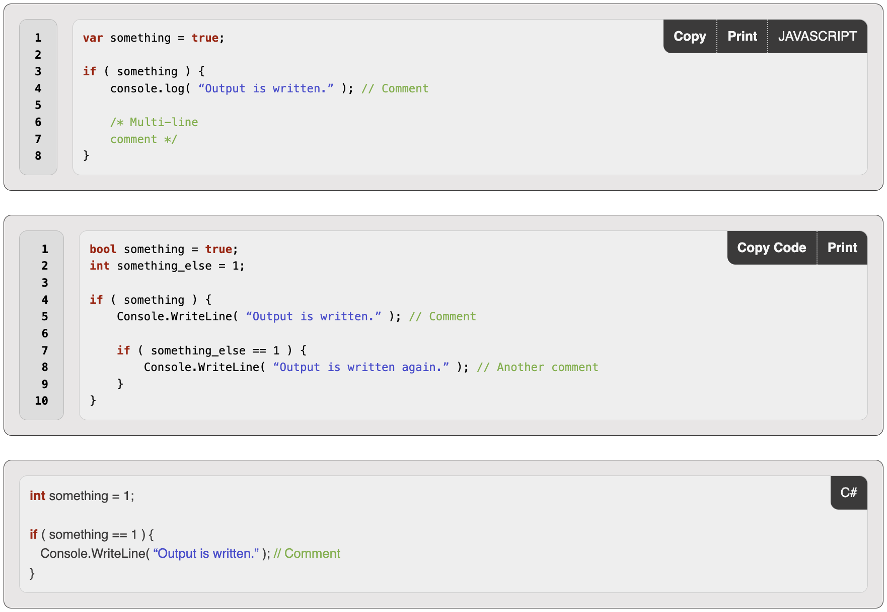

<h1 align="center">
Syntax.js

[](https://twitter.com/intent/tweet?text=Syntax.js%2C%20a%20free%20JavaScript%20syntax%20highlighter&url=https://github.com/williamtroup/Syntax.js&hashtags=javascript,syntax,highlighter)
[](https://www.npmjs.com/package/jsyntax.js)
[](https://www.nuget.org/packages/jSyntax.js/)
[](https://github.com/williamtroup/Syntax.js/blob/main/LICENSE.txt)
[](https://github.com/williamtroup/Syntax.js/discussions)
[](https://github.com/williamtroup)
</h1>

> <p align="center">A lightweight, and easy-to-use, JavaScript library for code syntax highlighting!</p>
> <p align="center">v1.5.0</p>
<br />


<br>
<br>

<h1>What features does Syntax.js have?</h1>

- Zero-dependencies and extremely lightweight!
- Full API available via public functions.
- Fully styled in CSS/SASS (including the buttons) and compatible with the Bootstrap library.
- Full CSS theme support (using :root variables).
- Coping and Printing support is available via action buttons.
- Custom triggers for actions (when elements are rendered, keywords are clicked, etc).
- 12 of the most popular languages built in by default (you can add your own easily if yours is not supported by default).
- Unknown language support (renders the display, but does not highlight any syntax).
<br />
<br />

<h1>What browsers are supported?</h1>

All modern browsers (such as Google Chrome, FireFox, and Opera) are fully supported.
<br>
<br>

<h1>What are the most recent changes?</h1>

To see a list of all the most recent changes, click [here](docs/CHANGE_LOG.md).
<br>
<br>

<h1>How do I get started?</h1>

To get started using Syntax.js, do the following steps:
<br>
<br>

### 1. Prerequisites:

Make sure you include the "DOCTYPE html" tag at the top of your email, as follows:

```markdown
<!DOCTYPE html>
```
<br>

### 2. Include Files:

```markdown
<link rel="stylesheet" href="dist/syntax.js.css" />
<script src="dist/syntax.js"></script>
<script src="dist/languages/syntax.javascript.js"></script>
```
<br>

### 3. Create DOM Container:

```markdown
<div data-syntax-language="javascript">
    var something = true;

    if ( something ) {
        console.log( "Output is written." ); // Comment
        
        /* Multi-line
        comment */
    }
</div>

<code data-syntax-language="javascript" data-syntax-options="{ 'showCopyButton': false }">
    <pre>
        var something = true;

        if ( something ) {
            console.log( "Output is written." ); // Comment
            
            /* Multi-line
            comment */
        }
    </pre>
</code>
```

To see a list of all the available options you can use for "data-syntax-options", click [here](docs/OPTIONS.md).

To see a list of all the available custom triggers you can use for "data-syntax-options", click [here](docs/CUSTOM_TRIGGERS.md).

<br>

### 4. Finishing Up:

That's it! Nice and simple. Please refer to the code if you need more help (fully documented).
<br>
<br>

<h1>How do I go about customizing Syntax.js?</h1>

To customize, and get more out of Syntax.js, please read through the following documentation.
<br>
<br>

### 1. Public Functions:

To see a list of all the public functions available, click [here](docs/FUNCTIONS.md).
<br>
<br>